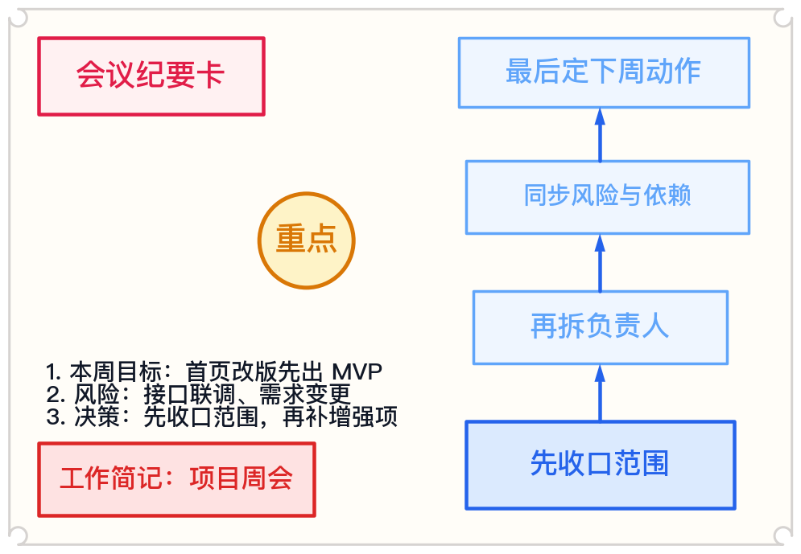
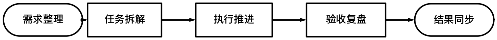
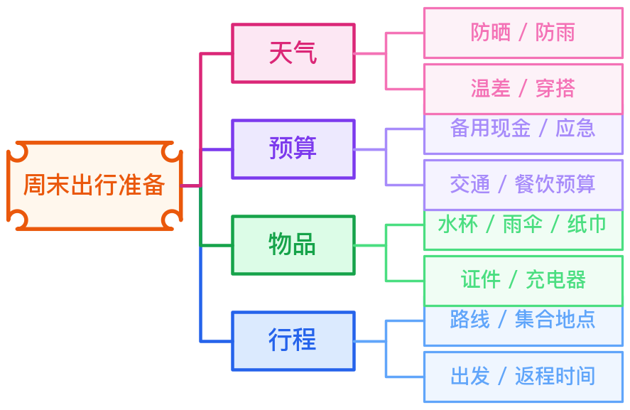
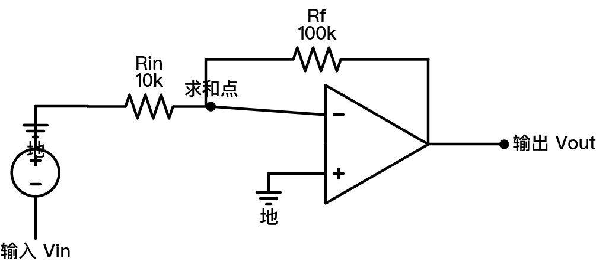
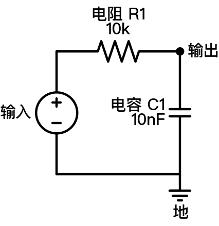

<div align="center">

# 图示工坊.skill

> 面向工作、生活与技术表达的结构化图示 skill

[](https://python.org)
[](https://schemdraw.readthedocs.io/)
[](https://openai.com)
[](LICENSE)

**图示工坊.skill** 是一个基于 `SchemDraw 0.22` 的中文友好 skill 与渲染器项目。  
它用于把结构化信息稳定地输出为 `SVG` 或 `PNG` 图像，适合工作简记、生活规划、流程梳理、思维导图，以及规整的技术示意图。

</div>

---

中文名：**图示工坊.skill**  
英文名：**Diagramry.skill**

## 适用场景

- 工作场景：会议纪要卡、任务推进图、流程图、复盘图
- 生活场景：出行准备图、清单整理图、计划卡片、思维导图
- 技术场景：框图、电路图、由方框、圆形、箭头、线条组成的规范示意图

## 主要能力

- 基于 `circuit`、`blocks`、`shapes` 三类规范化描述生成图像
- 输出 `SVG` 与 `PNG`
- 支持中文字体回退与框内文本自动居中、缩放
- 用 JSON spec 驱动渲染，结果稳定、可复现、可版本管理
- 既能画工作/生活图示，也能画技术类结构图与电路图

## 食用方法

- `用图示工坊帮我画一张项目周会简记图，输出 PNG，中文标签。`
- `用图示工坊画一个任务推进流程图：需求整理 -> 任务拆解 -> 执行推进 -> 验收复盘 -> 结果同步。`
- `用图示工坊做一个生活思维导图，主题是周末出行准备。`
- `用图示工坊画一个 RC 低通滤波器电路图，中文标注。`

## 示例展示

### 工作与生活图示

**工作简记图**



**任务推进流程图**



**思维导图**



### 技术图示

**运放反相放大器**



**RC 低通滤波器**



## 特性

- 按新版 `SchemDraw 0.22` 设计
- 同时覆盖 `circuit`、`blocks`、`shapes`
- 标签支持更稳的字体回退与文本贴合
- 不依赖临时脚本拼接
- 示例图与示例 spec 一一对应，仓库内可直接重渲染

## 开发与调试

```powershell
py -3.11 -m venv .venv
.\.venv\Scripts\python.exe -m pip install --upgrade pip
.\.venv\Scripts\python.exe -m pip install -r .\requirements.txt
```

## 渲染示例

渲染工作简记图：

```powershell
.\.venv\Scripts\python.exe .\scripts\render_diagram.py `
  --input .\assets\examples\quick-notes-zh.json `
  --output .\outputs\quick-notes-zh.png
```

渲染任务流程图：

```powershell
.\.venv\Scripts\python.exe .\scripts\render_diagram.py `
  --input .\assets\examples\control-blocks-zh.json `
  --output .\outputs\control-blocks-zh.svg
```

渲染技术电路图：

```powershell
.\.venv\Scripts\python.exe .\scripts\render_diagram.py `
  --input .\assets\examples\opamp-inverting-zh.json `
  --output .\outputs\opamp-inverting-zh.svg
```

更多字段说明见 [references/spec.md](references/spec.md)。

## 项目结构

```text
diagramry-skill/
├── SKILL.md
├── README.md
├── LICENSE
├── requirements.txt
├── agents/
│   └── openai.yaml
├── assets/
│   ├── examples/
│   └── previews/
├── references/
│   └── spec.md
└── scripts/
    └── render_diagram.py
```

## 许可

本项目基于 [MIT License](LICENSE) 发布。
